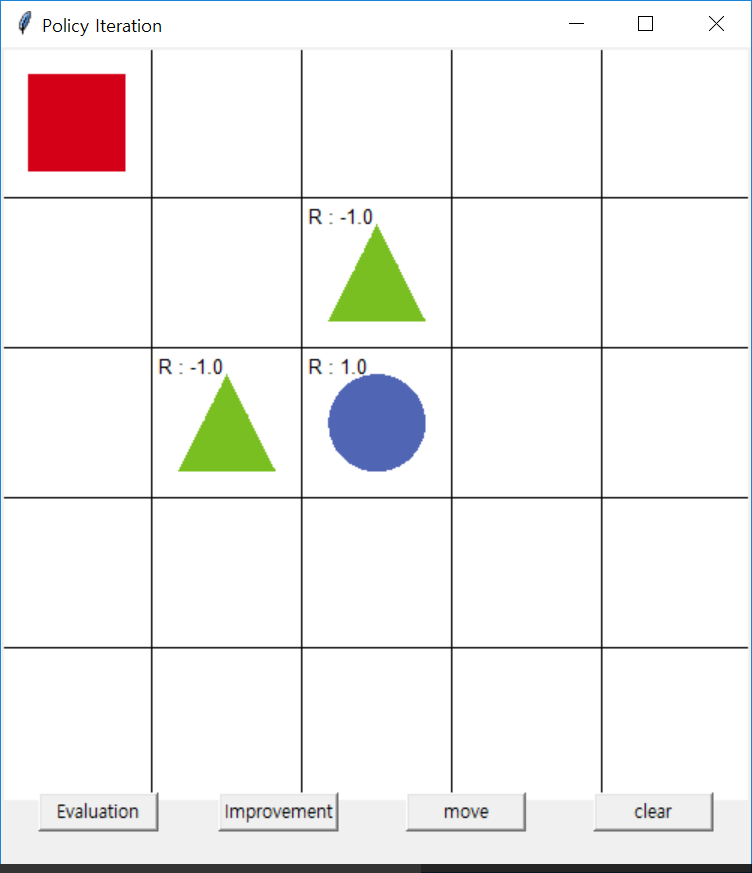
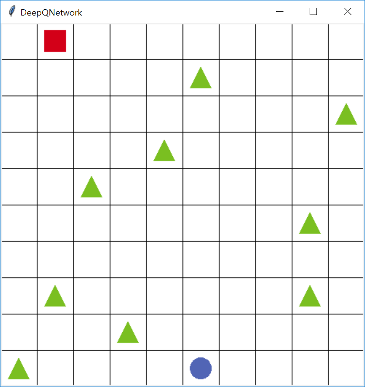

# Grid World with Reinforcement Learning 
This is Grid World example that we made for the simple algorithm test
The game is simple. The red rectangle must arrive in the circle, avoiding triangle.

 

## Dynamic Programming
**1. Policy Iteration**

**2. Value Iteration**
    
 

## Reinforcement Learning Fundamental Algorithms
**3. Monte-Carlo**

**4. SARSA**

**5. Q-Learning**

 

## Futher Reinforcement Learning Algorithms
>we have changed Grid World so the obstacles are moving. To solve this problem, we have to use function approximator. 
We used Neural Network as function approximator

 

**6. DQN**

**7. Policy Gradient**
    
    
