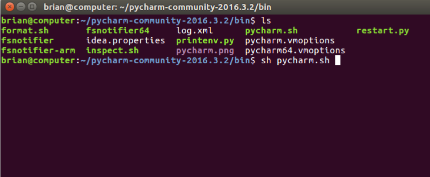
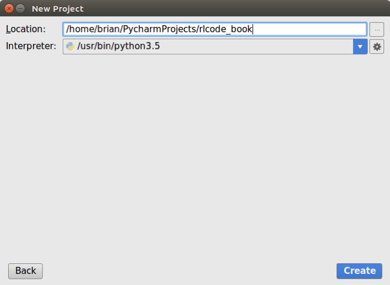
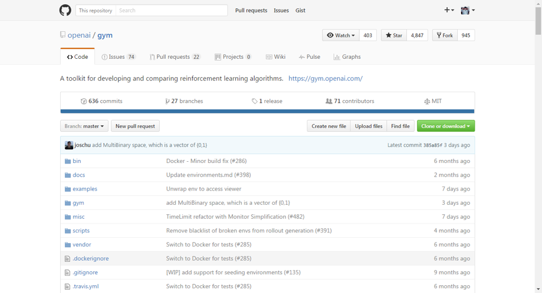
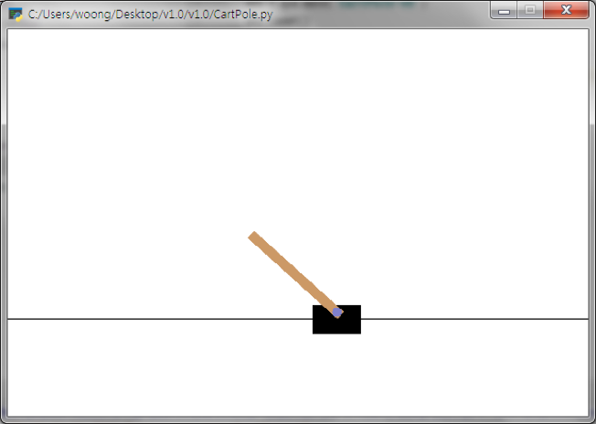
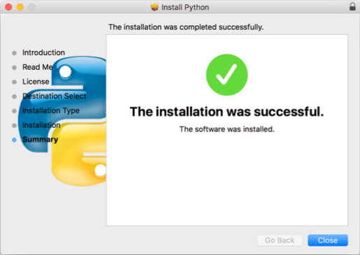
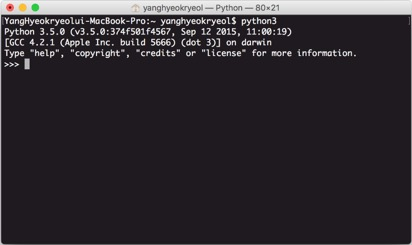
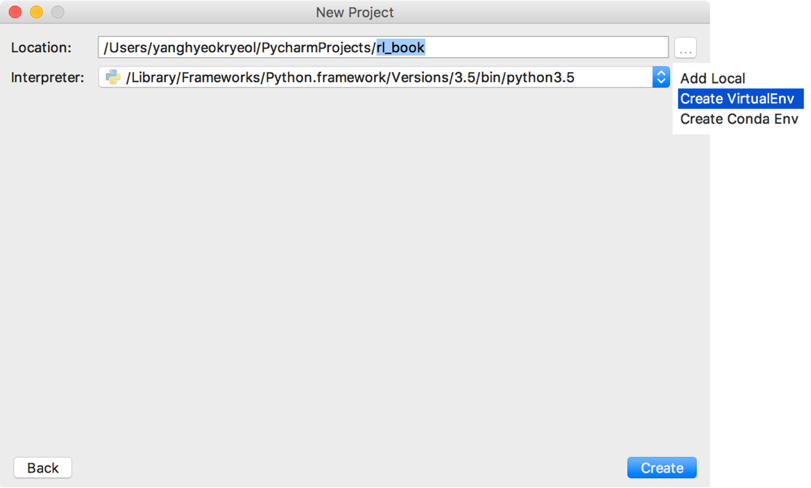
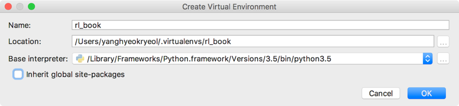
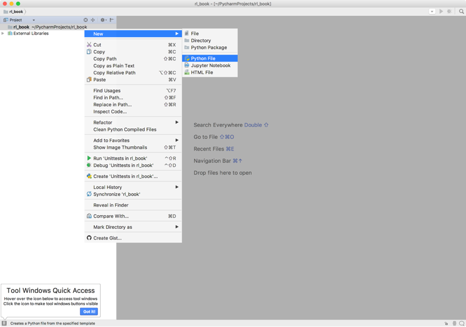

## 개발 환경 설정 1: 리눅스 (우분투)

리눅스는 소스코드가 공개된 대표적인 오픈소스 운영체제입니다. 리눅스는 모든 소스가 공개되어 있으므로 정말 많은 종류가 있습니다. 그중에서도 우분투(Ubuntu)가 가장 넓은 사용자를 가진 배포판입니다. 매년 상반기 하반기 우분투 재단에서 새로운 버전을 배포하는데 이 책에서는 14년 상반기에 배포한 우분투 14.04 버전을 사용할 것입니다. 우분투 14.04가 설치되어 있다는 가정에 따라 이후의 개발환경 설정을 설명할 것입니다.


### 2.1.1 우분투 파이썬의 버전 확인

리눅스의 장점은 바로 파이썬(Python)이 설치가 기본적으로 되어 있다는 것입니다. 파이썬은 2.X 버전과 3.X버전이 있는데 이 책에서는 `파이썬 3.5버전`을 사용할 것입니다. 바탕화면에서 `Ctrl+Alt+t`를 누르면 터미널 창이 뜨는데
여기에 다음 명령어를 치고 엔터를 누르면 설치된 파이썬의 버전을 확인할 수 있습니다.

```python
$ python -V
```

우분투 14.04 버전에는 `파이썬 2.7버전`과 `3.5버전`이 기본적으로 설치되어 있습니다.


### 2.1.2 파이참 커뮤니티 설치 및 환경 설정

앞으로 강화학습 에이전트를 만들고 가상 환경에서 에이전트를 학습시킬 것입니다. 그러기 위해 코드를 짜고 편집하는
환경이 필요한데 그러한 환경을 IDE(interface Development Environment)라고 합니다. IDE에는 많은 종류가 있지만 이 책에서는 파이참(Pycharm)을 파이썬을 위한 IDE로 사용할 것입니다. 

파이참의 설치는 파이참의 공식 홈페이지[[1\]](#_ftn1)를통해서 할 수 있습니다. 홈페이지에서 윈도우, 리눅스, 맥 OS 버전의 파이참을 다운로드 할 수 있습니다. 파이참은 유료 버전인 `프로페셔녈(PyCharm ProfessionalEdition)`과, 무료 버전인 `커뮤니티(PyCharm Community Edition)`으로 나뉩니다. 앞으로 에이전트를 개발할 때 `파이참 커뮤니티`를 사용할 것이므로 커뮤니티 버전을 기준으로 설치법을 설명할 것입니다.


**설치는 다음과 같은 순서로 진행합니다. **

1. 파이참 공식 홈페이지 링크에서 파이참 커뮤니티버전을 다운로드합니다.

   ​

   링크: [https://www.jetbrains.com/pycharm/download/#section=linux](https://www.jetbrains.com/pycharm/download/#section=linux)

   

   ​

2. 다운받은 경로로 들어가서 다음 명령어로 압축파일을 풀어줍니다.

   ```shell
   $tar xfz pycharm-community-2016.3.2.tar.gz
   ```


3. 압축을 푼 후 아래 경로(bin폴더)로 이동합니다.

   ```shell
   $cd ~/pycharm-community-2016.3.2/bin
   ```
   ​

4. 다음 명령어로 파이참을 실행합니다.

   ```shell
   $sh pycharm.sh
   ```
   ​

   

   ​


5. 명령어가 실행되면 설치가 시작됩니다.

   ​

6. 설치가 완료되면 다음 화면과 같은 초기 환경설정 화면을 볼 수 있습니다. 

   ​

   

   ​

   IDE theme 항목에서 Intellij는 바탕이 흰색인 테마이고 Darcula 테마는 바탕이 검은색입니다. 이
   책에서는 Intellij를 테마로 사용합니다.

   ​

7. 초기설정이 완료된 후의 화면입니다. 여기서 프로젝트 생성을 해봅니다.

   

   ​

   ​

8. 프로젝트의 경로와 Interpreter를 설정하는 화면입니다. Home 디렉터리에 PycharmProjects 폴더를 생성하고 그 하위에 프로젝트를 생성합니다. 프로젝트의 이름은 독자가 임의로 정하도록 합니다. “rlcode_book” 이름으로 프로젝트를 생성하는데 Interpreter를 설정해줍니다. Interpreter는 이 프로젝트에서 사용할 언어인데 python 3.5라고 설정합니다.

   ​

   
   ​

9. rlcode_book 프로젝트가 생성되면 아래와 같은 화면이 나옵니다.

   ​

   

   ​

   ​

10. 파이참이 정상적으로 설치되었는지 확인하기 위해 파이썬 스크립트 파일을 생성해봅니다. 가장 간단한 예제인 `“Hello World”`를 실행하기 위해 다음과 같이 hello_world.py 파일을 생성합니다.
  ​

 
 ​

11. 생성한 파일에 마우스 커서를 놓고 오른쪽 버튼을 누르면 여러 항목이 나옵니다. 그 중에서 “Run ‘hello_world’” 버튼을 누르면 hello_world.py 파일을 실행할 수 있습니다. 
    ​

    

    ​


12. hello_world.py 파일 안에 다음 코드를 입력합니다.
   ```python
   print("hello world")
   ```


13. hello_world.py 파일을 실행시키면 아래 화면과 같이 실행 창에 “hello world”가 나옵니다. 이를 통해 파이참이 정상적으로 설치된 것을 확인할 수 있습니다.

  ​

  

  ​


###Virtualenv(가상환경) 사용법 :happy: 

여기까지가기본적인 파이참의 환경설정입니다. 한 컴퓨터에서 여러가지 프로젝트를 진행할 경우에 프로젝트마다 개발환경이다를 수 있습니다. 서로 다른 프로젝트의 개발환경이 다를 경우에 사용자는 상당한 불편을 겪을 수 있습니다. 따라서 프로젝트별로 개발환경을 분리해서 관리하는 것은 상당한 장점이 있는데 그 기능을 하는 것이 VirtualEnv입니다. VirtualEnv를 사용하면 이 책의 프로젝트만을위한 가상 개발환경을 만들 수 있습니다. 

파이참은VirtualEnv를 지원하기 때문에 파이참으로 VirtualEnv를사용하는 법을 설명하겠습니다. VirtualEnv의 설치 및 사용 방법은 여러 가지가 있지만 위에서설치한 파이참을 이용하면 GUI(graphic user interface)형식으로 VirtualEnv를 사용할 수 있습니다. 그리고 파이참은 가상 개발환경에설치된 다양한 파이썬 외부 라이브러리들을 관리 할 수 있는 기능을 제공합니다. 

**파이참에서 VirtualEnv 이용방법은 다음과 같습니다.**

1. “File” 메뉴에서 “Settings”를 클릭합니다. 

   ​

   

   ​

2. Settings의 왼쪽 목록에서 “Project: 프로젝트명”의 하위 항목인 Project Interpreter 클릭합니다. 그리고 Project Interpreter 탭 오른쪽에서 “Create VirtualEnv”를 클릭합니다. 

   ​

   

   ​

3. 가상환경 이름을 입력하면 /home/brian/rlcode_book 디렉토리가 생성되어 가상환경이 생깁니다.

   ​

   

   ​

4. 아래와 같이 터미널 창에 (rlcode_book) 표시가 된다면 rlcode_book이름을 가진 가상 환경이 생긴 것입니다. 이제 이 환경을 이 책을 위한 가상환경으로 사용하겠습니다.

   ​

   

   ​

### 2.1.3 오픈에이아이 설치 및 테스트

2016년에 오픈에이아이(OpenAI)라는 회사가 세워졌습니다. 이 회사의 목표는 인공지능 기술을 전 세계에공개해서 더 안전한 인공지능을 만들어가며 더 많은 분야에 인공지능을 도입하는 것입니다. 오픈에이아이 짐(Gym)는 오픈에이아이에서 만든 환경인데여기서 여러가지 인공지능 알고리즘을 테스트 해볼 수 있습니다. 

오픈에이아이짐의 코드는 모두 오픈에이아이의 깃허브(Github)[[2\]](#_ftn1)에업로드되어있습니다.




오픈에이아이 짐의 설치는 공식 홈페이지에 설명되어있습니다. 오픈에이아이짐을 설치하기 위해서는 깃(Git)를 먼저 설치해줘야 합니다. 깃(Git)은 버전 관리 도구로서개발 프로세스에서 버전 관리가 필요할 때 주로 사용합니다. 오픈에이아이는 오픈소스로 깃헙(Github)에 공개되어 있습니다. 깃헙은 버전관리되는 소스 코드들의원격 저장소 역할을 하는 플랫폼입니다.   

다음과 같은 명령어로 깃를 설치합니다.

```shell
$ sudo apt-get install git
```


깃을 설치한 다음에 오픈에이아이 짐을 설치합니다. 터미널 창에서 오픈에이아이 짐을 설치할 디렉토리로 이동한 다음에 다음과 같은 명령어를 실행합니다. 

```shell
$ git clone https://github.com/openai/gym
$ cd gym
$ pip3 install -e
```


오픈에이아이 짐은 여러가지 다른 설정으로 설치할 수 있는데 `pip install -e .`은 가장 기본적인 부분들만 설치하는 것입니다. 이후에 아타리 게임 등 오픈에이아이 짐의 모든 게임들을 사용하려면 `pip install -e .` 대신에 다음과 같이 입력해야 합니다.

```shell
$ pip3 install -e .[all]
```


오픈에이아이 짐이 정상적으로 설치되었는지 확인하기 위해서 간단한 예제를 실행해봅니다. 오픈에이아이 짐의 가장 간단한 예제는 카트폴(CartPole)입니다. 카트폴은 카트에 진자가 달린 형태로 이 문제의 목표는 카트를 움직여서 그 반동으로 진자를 세우는 것입니다. 테스트할 때는 그냥 아무 입력도 카트폴에 주지 않은 상태로 오픈에이아이 짐이 제대로 실행되는지만 확인할 것입니다. 

`CartPole.py` 파일을 생성하고 코드 2.1과 같이 입력합니다.

```python
import gym
env = gym.make('CartPole-v0')
env.reset()
for _ in range(1000):
    env.render()
    env.step(env.action_space.sample()) # take a random action
```

​         					        	코드 2.1 카트폴 예제 실행 코드


이 코드를 실행하면 화면에 아무 행동도 하지 않는 카트폴이 실행됩니다. 오픈에이아이 짐은 이와 같은 많은 문제들을 제공하며 사용자들은 오픈에이아이 짐의 여러가지 문제에 자신의 학습 알고리즘을 적용해볼 수 있습니다. 또한 오픈에이아이 짐 사이트에 자신의 알고리즘을 공유하거나 결과를 확인할 수 있습니다. 





## 2.2 개발 환경 설정 2: 맥 OS

맥 OS에는 기본적으로 파이썬 2.7버전이 설치되어있기 때문에 3.5 버전을 새로 설치를 해야 합니다.

### 2.2.1 파이썬 3.5 설치 및 환경 설정

파이썬다운로드 페이지[[3\]](#_ftnref3)로접속하면 다음과 같은 화면이 나옵니다.


1. 위 화면에서 자신의 맥 OS 버전에 맞는 파일을 선택해서 다운로드합니다. 다운로드가 완료된 파일을 실행 후 안내에 따르면 설치가 완료됩니다.

   ​

   

   ​

2. 파이썬 설치가 정상적으로 완료됐는지 확인하기 위해서는 터미널을 실행합니다. 터미널 창에 ‘python3’ 명령어를 입력했을 때 다음 화면과 같이 출력된다면 정상적으로 설치된 것입니다.

   ​

   

   ​

### 2.2.2 파이참 커뮤니티 설치 및 환경 설정

파이참의 설치 및 환경 설정은 다음과 같은 순서로 진행합니다. 

1. 파이참홈페이지에 접속하여 커뮤니티버전을 다운로드합니다. 

2. 다운로드가 완료된 파일을 실행하고아래 그림에서 왼쪽 PyCharm CE 아이콘을 오른쪽 폴더 아이콘으로 드래그하면 설치가 완료됩니다.

   

3. 처음 파이참을 실행하게 되면 설정화면이 나오는데 IDE theme을 통해 IDE의 색상과 스타일을 변경할 수 있습니다. Default는 우분투의 개발환경설정에서 봤던 Intellij 테마입니다. 이 책에서는 Default를 사용할 것입니다.
   ​

4. 초기 설정을 완료하고 Create New Project 버튼을 클릭합니다.

   ​

5. Create New Project 버튼을 클릭하면 아래 그림과 같은 화면이 나옵니다. Location은 프로젝트가 생성될 경로와 프로젝트 폴더명을 설정하는 곳입니다. 프로젝트의 이름과 경로는 독자가 임의로 지정하면 됩니다.

   Interpreter는 프로젝트에서 어떤 파이썬 Interpreter를 사용할 것인지 고르는 것입니다. 우분투에서와 마찬가지로 VirtualEnv를 통해 가상 환경을 만들고 그것을 Interpreter로 사용할 것입니다. Create VirtualEnv 버튼을 누릅니다.

   ​

   

   ​

6. 아래 그림은 VirtualEnv의 생성화면입니다. Name과 Location은 여러분이 임의로 설정하면 됩니다. Base Interpreter는 위와 같이 새로 설치한 python3.5 를 선택합니다. OK버튼을 누르면 해당 VirtualEnv가 생성됩니다.

   ​

   

   ​

7. 처음 New Project 생성화면의 Interpreter에서 방금 생성한 VirtualEnv를 선택해줍니다. 그리고 Create버튼을 누르면 프로젝트 생성이 완료됩니다.

   ​

   

   ​

8. 프로젝트를 생성하고 나면 다음과 같은 작업 환경이 보입니다. 이 화면에서 최상위 폴더를 우클릭한 후 

   New -> Python File을 클릭하면 새로운 파이썬 파일을 생성할 수 있습니다. 

   ​

   

   ​

9. 파이참이 제대로 설치됐는지 확인하기 위해 hello world 예제를 실행해봅니다. 우분투에서와 동일하기 때문에 생략하겠습니다.

   ​

### 2.2.3 오픈에이아이 설치 및 테스트

오픈에이아이를 설치하고 카트폴을 실행해보는 단계는 우분투와 동일하므로 생략합니다.


------

[[1\]](#_ftnref1) https://www.jetbrains.com/pycharm/

[[2\]](#_ftnref2) https://github.com/openai/gym

[[3\]](#_ftnref3) https://www.python.org/downloads/release/python-350/
