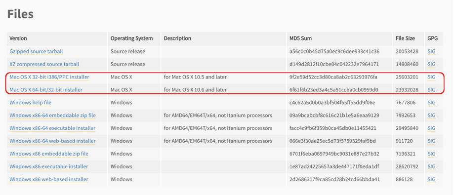
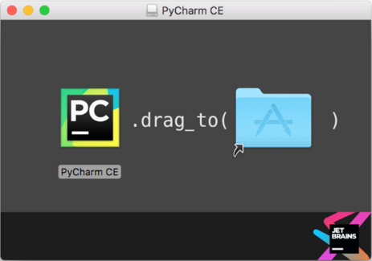

## 2.2 개발 환경 설정 2: 맥 OS

맥 OS에는 기본적으로 파이썬 2.7버전이 설치되어있기 때문에 3.5 버전을 새로 설치를 해야 합니다.

### 2.2.1 파이썬 3.5 설치 및 환경 설정

파이썬다운로드 페이지[[3\]](#_ftnref3)로접속하면 다음과 같은 화면이 나옵니다.

   

1. 위 화면에서 자신의 맥 OS 버전에 맞는 파일을 선택해서 다운로드합니다. 다운로드가 완료된 파일을 실행 후 안내에 따르면 설치가 완료됩니다.

   ​

   

   ​

2. 파이썬 설치가 정상적으로 완료됐는지 확인하기 위해서는 터미널을 실행합니다. 터미널 창에 ‘python3’ 명령어를 입력했을 때 다음 화면과 같이 출력된다면 정상적으로 설치된 것입니다.

   ​

   

   ​

### 2.2.2 파이참 커뮤니티 설치 및 환경 설정

파이참의 설치 및 환경 설정은 다음과 같은 순서로 진행합니다. 

1. 파이참홈페이지에 접속하여 커뮤니티버전을 다운로드합니다. 

2. 다운로드가 완료된 파일을 실행하고아래 그림에서 왼쪽 PyCharm CE 아이콘을 오른쪽 폴더 아이콘으로 드래그하면 설치가 완료됩니다.

   

3. 처음 파이참을 실행하게 되면 설정화면이 나오는데 IDE theme을 통해 IDE의 색상과 스타일을 변경할 수 있습니다. Default는 우분투의 개발환경설정에서 봤던 Intellij 테마입니다. 이 책에서는 Default를 사용할 것입니다.
   ​

4. 초기 설정을 완료하고 Create New Project 버튼을 클릭합니다.

   ​

5. Create New Project 버튼을 클릭하면 아래 그림과 같은 화면이 나옵니다. Location은 프로젝트가 생성될 경로와 프로젝트 폴더명을 설정하는 곳입니다. 프로젝트의 이름과 경로는 독자가 임의로 지정하면 됩니다.

   Interpreter는 프로젝트에서 어떤 파이썬 Interpreter를 사용할 것인지 고르는 것입니다. 우분투에서와 마찬가지로 VirtualEnv를 통해 가상 환경을 만들고 그것을 Interpreter로 사용할 것입니다. Create VirtualEnv 버튼을 누릅니다.

   ​

   

   ​

6. 아래 그림은 VirtualEnv의 생성화면입니다. Name과 Location은 여러분이 임의로 설정하면 됩니다. Base Interpreter는 위와 같이 새로 설치한 python3.5 를 선택합니다. OK버튼을 누르면 해당 VirtualEnv가 생성됩니다.

   ​

   

   ​

7. 처음 New Project 생성화면의 Interpreter에서 방금 생성한 VirtualEnv를 선택해줍니다. 그리고 Create버튼을 누르면 프로젝트 생성이 완료됩니다.

   ​

   

   ​

8. 프로젝트를 생성하고 나면 다음과 같은 작업 환경이 보입니다. 이 화면에서 최상위 폴더를 우클릭한 후 

   New -> Python File을 클릭하면 새로운 파이썬 파일을 생성할 수 있습니다. 

   ​

   

   ​

9. 파이참이 제대로 설치됐는지 확인하기 위해 hello world 예제를 실행해봅니다. 우분투에서와 동일하기 때문에 생략하겠습니다.

   ​

### 2.2.3 오픈에이아이 설치 및 테스트

오픈에이아이를 설치하고 카트폴을 실행해보는 단계는 우분투와 동일하므로 생략합니다.

------

[[1\]](#_ftnref1) https://www.jetbrains.com/pycharm/

[[2\]](#_ftnref2) https://github.com/openai/gym

[[3\]](#_ftnref3) https://www.python.org/downloads/release/python-350/
